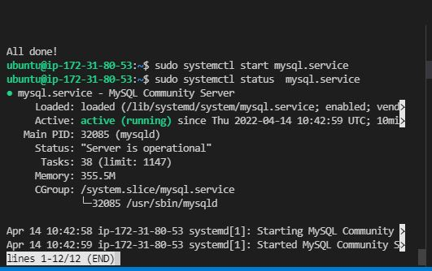
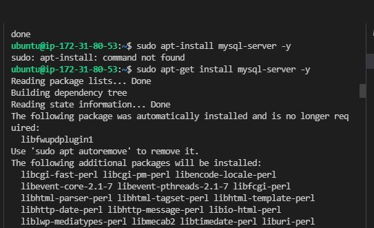
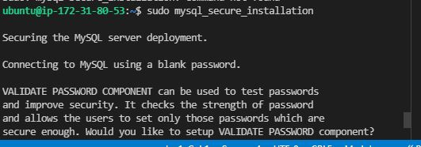
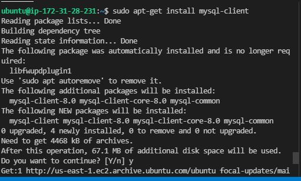
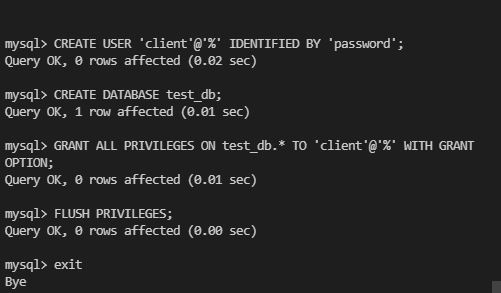
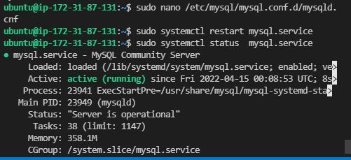
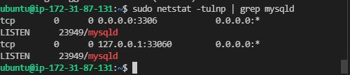
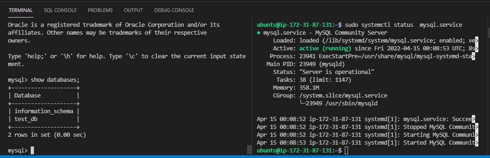

### Step 1
  - update and upgrade both client and server machines 
	- `sudo apt update && sudo apt upgrade`

	- 

  - install client and server bin files on seperate machines 
	- `sudo apt-get install mysql-server`
	- `sudo mysql_secure_installation`

    - 

    - 

### Step 2	
  - `sudo apt-get install mysql-client`
    - 

### Step 3	
  - start mysql-server service on the server 
	- `sudo systemctl start mysql.service`
    - 

### Step 4
 -  create and configure new user 
  
   -  ```
	    sudo mysql
	    mysql -u root -p # password set from secure_installation
	    CREATE USER 'client'@'%' IDENTIFIED BY 'password';
	    FLUSH PRIVILEGES;
	    GRANT ALL PRIVILEGES ON test_db.* TO 'client'@'%' WITH GRANT OPTION;
      ```

    - 

### Step 5
  - configure firewall to accept incoming connections 
  
  	- `sudo nano /etc/mysql/mysql.conf.d/mysqld.cnf  change bind-address = 0.0.0.0`

### restart server 
  - `sudo systemctl start mysql.service`

    

### Step 5
  - ensure mysql server is listening on port 3306 
	- `sudo netstat -tulnp | grep mysqld`

    - 

  - Update firewall
  
	- `sudo ufw allow 3306/tcp`

  - Test connection from remote client
  
	- `mysql -h 192.168.1.100 -u username -p` IP ADDRESS is that of the SQL SERVER

    - 

